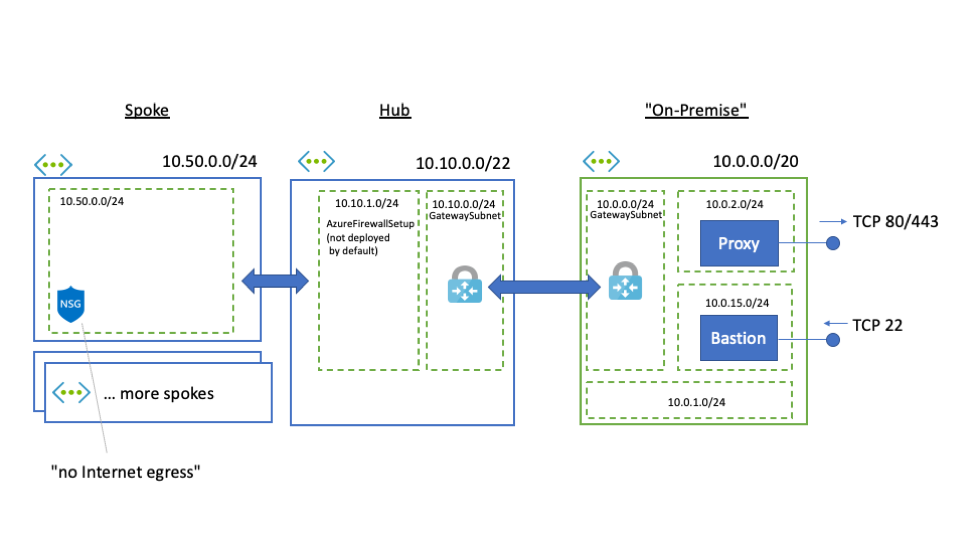

# Deploy and Enterprise-Like Network Setup in Azure

This repo contains a set auf automation helpers that will deploy a network setup in Azure that can be 
used to experiment with typical Enterprise challenges in networking. One very common scenario
is the existence of a Proxy-server that is used to safeguard the egress communication at one specific
choke point.

## Overview

This is basically the outcome of the infrastructure as code artifacts which are provided in this repository: 



An simulated "On-Premise" virtual network is deployed which hosts a good old [Squid proxy](http://www.squid-cache.org/) 
VM and a bastion VM. The proxy is configured to allow outgoing HTTP traffic on port 80 and 443. 
It is fully whitelisted and you can use the Squid access logs to analyse the traffic.

The "On-Premise" virtual network is connected to a hub network via a VPN Gateway. The hub network is peered with spoke 
networks (per default, only one spoke network will be deployed). The hub does not contain any additional appliances. Neither
does it provide a direct Internet breakout. Thus all Internet directed traffic needs to traverse via the "On-Premise" proxy.

Future additions to this template, might introduce an Azure Firewall in the hub network to provide a direct Internet route.

## Prerequisites

* An Azure Subscription
* [Azure CLI](https://docs.microsoft.com/en-us/cli/azure/install-azure-cli?view=azure-cli-latest) is installed
* [PowerShell Core](https://github.com/PowerShell/PowerShell) is installed
* [Ansible](https://docs.ansible.com/ansible/latest/installation_guide/intro_installation.html) is installed locally *or* executed via the Bastion

This setup was only verified on Linux and Mac, but it should run on Windows as well.

## Deployment Steps

### Step 1: Base Deployment

First, we will run a relatively complex Terraform Infrastructure as Code deployment. There is a small PowerShell Core
helper script that will make the setup a little bit simpler. Checkout the source code and open a PowerShell Core
shell. 

```sh
cd ./src/
./tf.ps1 -Apply -TfPrefix contoso -TargetPath 01-enterprise-network-simulation -Force -LeaveFirewallOpen -SkipFirewallUpdate -Verbose 
```

The `-TfPrefix` parameter can be changed to a value that depicts your setup, e.g. 'fabrikam', 'foo', or 'contoso' (regex: "[a-z]+").

Per default your public key from `~/.ssh/id_rsa.pub` is used to setup the SSH login for the Bastion VM and the Proxy VM. 
If you want to specify another public key, you can simply setup an environment variable `TF_VAR_public_ssh_key_admin` 
with the public key string. For example:

```sh
export TF_VAR_public_ssh_key_admin="ssh-rsa AAA...=="
``` 

This deployment will run approx. 45min as the VPN gateways will take considerable time. The outcome of the deployment
matches the overview diagram. The proxy VM, however is not yet initialized. It is still a blank VM. The proxy configuration
happens in the second step.

### Step 2: Deploy Proxy

The proxy will be deployed via Ansible. There are two options: either you connect to the Bastion host and checkout
this GitHub repo there (Ansible is pre-installed on the Bastion host). Or you run the Ansible script locally.

#### Option 1: Deploy via Bastion

```bash
export BASTION_HOST=host_or_ip
ssh azureuser@$BASTION_HOST

git clone https://github.com/olohmann/azure-enterprise-network-playground.git
cd azure-enterprise-network-playground/src/02-middleware-deployments

ansible-playbook playbook.yml
```

If you run into troubles, please verify the `inventory/hosts` setup. It should point to the correct private IP address
of the Proxy VM. If you modified the Terraform setup, this might not be the case. You can then take an updated
hosts file from your Terraform run: `./src/01-enterprise-network-simulation/<prefix>-dev-inventory.cfg`.

Also, you need to be able to connect to the Proxy VM via SSH. That is, you either need to connect to the bastion host
with agent forwarding (`-A`) or put the private key that you used for the VM setup on the bastion host.

#### Option 2: Deploy from Localhost

When you want to run the deployment from the localhost, you need to have Ansible installed and also an established
 tunnel to the target Proxy VM. This can be achieved via [sshuttle](https://github.com/sshuttle/sshuttle)

In your first shell session:
```bash
export BASTION_HOST=host_or_ip
sshuttle -r azureuser@$BASTION_HOST 10.0.0.0/8 
```

... and in the second session you can now execute the Ansible playbook:

```bash
cd ./src/02-middleware-deployments
ansible-playbook playbook.yml
```
